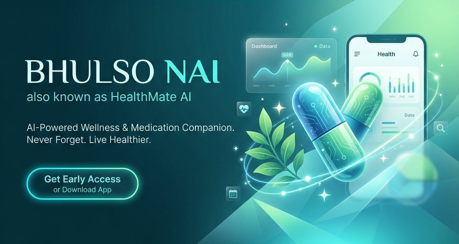

# 🩺 Bhulso Nai (HealthMate AI)

A trilingual, privacy-first health companion app that helps you and your family manage medications, track daily health metrics, and analyze symptoms with AI — with Ayurvedic home remedy suggestions built in.

---

## 📌 Project Overview

**Bhulso Nai** (*"Don't Forget"* in Gujarati) is a full-stack health management platform available on both **Web** and **Mobile**. It is designed for individuals and families who want a single, unified tool to track medications, log daily health data, and get intelligent symptom guidance — all in their preferred language.

The project is built on a shared **Supabase (PostgreSQL)** backend with Row-Level Security, ensuring each user's data stays private and isolated. The web app is powered by **TanStack Start + React 19**, while the mobile app uses **Expo + React Native** with Expo Router.

---

## 🖼️ Banner



---

## 📊 App Features

### 💻 Web Application

The web app consists of **6 core sections** with real-time data and cross-language support:

| Section | Description |
| :--- | :--- |
| 🏠 **Dashboard** | Medication timeline by Morning / Afternoon / Evening. One-tap mark as Taken / Missed / Skipped. Daily Health Score (0–100) from adherence, water, sleep, and mood |
| 💊 **Medicines** | Add and manage medications with custom pill colors, dosages, tags, duration, meal timing, and family member assignment |
| 📋 **Health Log** | Log daily mood (5 levels), water intake (glasses), sleep hours, and free-text symptoms. View history with monthly trends |
| 👨‍👩‍👧 **Family** | Track medications and health data for dependents (e.g. parents, children) from one account |
| 🤖 **AI Symptoms** | Describe symptoms in any language — get urgency level (Low / Medium / High), possible causes, self-care steps, and Ayurvedic suggestions |
| ⚙️ **Settings** | Manage profile, preferred language, notification preferences, and password |

### 📱 Mobile Application (Expo)

| Feature | Description |
| :--- | :--- |
| 📲 **Native Screens** | Built with Expo Router — optimized layouts for iOS and Android |
| 🎯 **Onboarding** | Configure wake-up/sleep times, chronic conditions, and personal health goals on first launch |
| 🔔 **Push Notifications** | Medicine reminders via `expo-notifications` |
| 🌐 **Supabase Sync** | Real-time data sync and AI symptom analysis via Supabase Edge Functions |
| 🌍 **Multilingual** | English, Hindi, and Gujarati — same as the web app |

---

## 🔍 Key Highlights

- **Trilingual UI** — Full English, Hindi (हिंदी), and Gujarati (ગુજરાતી) support with real-time switching
- **AI Symptom Analyzer** — Accepts input in any language; returns structured urgency + causes + care tips
- **Ayurvedic Suggestions** — Traditional remedies (Tulsi tea, Haldi milk, ginger) shown alongside modern advice
- **Family Health Tracking** — One account manages medications for the whole family
- **Health Score System** — Composite daily score across 5 metrics to motivate healthy habits
- **PDF Export** — Monthly health history exportable for doctor consultations
- **Privacy First** — RLS enforced on every table; users only ever see their own data

---

## 🗂️ Database Schema

The app is powered by **Supabase (PostgreSQL)** with the following tables:

### **`profiles`** — User information

| Column | Type | Description |
| :--- | :--- | :--- |
| `id` | `UUID` | Primary key, references `auth.uid()` |
| `name` | `TEXT` | Display name |
| `language` | `TEXT` | Preferred UI language (`en`, `hi`, or `gu`) |
| `dob` | `DATE` | Date of birth |
| `age` | `INTEGER` | User age |
| `gender` | `TEXT` | User gender |
| `conditions` | `TEXT[]` | Chronic conditions configured during onboarding |
| `goals` | `TEXT[]` | Health goals configured during onboarding |
| `wake_time` | `TEXT` | Wake up time (e.g., `"07:00"`) |
| `sleep_time` | `TEXT` | Bedtime (e.g., `"22:00"`) |
| `onboarded` | `BOOLEAN` | Flag indicating onboarding completeness |

### **`medicines`** — Medication records

| Column | Type | Description |
| :--- | :--- | :--- |
| `id` | `UUID` | Primary key |
| `user_id` | `UUID` | References `auth.users` |
| `name` | `TEXT` | Medicine name |
| `dosage` | `TEXT` | Dose amount (e.g., `"1 pill"`) |
| `medicine_type`| `TEXT` | Type of medicine (e.g., `"tablet"`) |
| `reminder_times`| `TEXT[]` | Array of scheduled dose times (e.g., `["08:00", "20:00"]`) |
| `meal_timing` | `TEXT` | Before / After meals (`"before"`, `"after"`, `"none"`) |
| `duration_days`| `INTEGER` | Course length in days |
| `tags` | `TEXT[]` | Label tags |
| `pill_color` | `TEXT` | Hex code for UI pill color |
| `member_id` | `UUID` | Links to `family_members` (null if self) |
| `active` | `BOOLEAN` | Active status of the medication |
| `start_date` | `DATE` | Treatment start date |
| `end_date` | `DATE` | Treatment end date |

### **`health_logs`** — Daily health logging

| Column | Type | Description |
| :--- | :--- | :--- |
| `id` | `UUID` | Primary key |
| `user_id` | `UUID` | References `auth.users` |
| `log_date` | `DATE` | Date of the log entry |
| `mood` | `INTEGER` | Mood scale (1–5) |
| `water_glasses`| `INTEGER` | Water glasses consumed |
| `sleep_hours` | `NUMERIC` | Sleep hours |
| `symptoms` | `TEXT[]` | Array of logged symptoms |
| `member_id` | `UUID` | Links to `family_members` (null if self) |
| `notes` | `TEXT` | Additional health notes |

### **`reminders`** — Medication adherence tracking

| Column | Type | Description |
| :--- | :--- | :--- |
| `id` | `UUID` | Primary key |
| `user_id` | `UUID` | References `auth.users` |
| `medicine_id` | `UUID` | Links to `medicines` |
| `scheduled_date`| `DATE` | Date of the scheduled dose |
| `scheduled_time`| `TEXT` | Time of the scheduled dose |
| `status` | `TEXT` | Adherence status (`pending`, `taken`, `missed`, `skipped`) |
| `taken_at` | `TIMESTAMPTZ` | Timestamp when marked taken |

### **`family_members`** — Dependent profiles

| Column | Type | Description |
| :--- | :--- | :--- |
| `id` | `UUID` | Primary key |
| `user_id` | `UUID` | References `auth.users` |
| `name` | `TEXT` | Family member's name |
| `relation` | `TEXT` | Relationship to user (e.g., spouse, parent, child) |
| `age` | `INTEGER` | Member age |
| `color` | `TEXT` | Avatar background color tag |

### **`push_subscriptions`** — Push notification endpoints

| Column | Type | Description |
| :--- | :--- | :--- |
| `id` | `UUID` | Primary key |
| `user_id` | `UUID` | References `auth.users` |
| `endpoint` | `TEXT` | Push notification endpoint URL |
| `p256dh` | `TEXT` | Client public key key |
| `auth` | `TEXT` | Auth secret |

---

## 🛠️ Tools & Technologies

| Layer | Web | Mobile |
| :--- | :--- | :--- |
| **Framework** | React 19 + TypeScript | React Native + TypeScript |
| **Meta-Framework** | TanStack Start | Expo + Expo Router |
| **Styling** | Tailwind CSS v4 + Shadcn UI + Framer Motion | React Native StyleSheet + LinearGradient |
| **Database & Auth** | Supabase JS + RLS | Supabase JS + AsyncStorage |
| **State Management** | TanStack Query | Supabase Client SDK |
| **i18n** | `i18next` + `react-i18next` | `i18next` + `react-i18next` |
| **PDF Export** | `jspdf` | — |
| **Notifications** | Browser Notification API | `expo-notifications` |

---

## 🚀 How to Use

### Option 1: Run the Web App Locally

1. Clone the repository:
   ```bash
   git clone https://github.com/Anandvaghela04/health-wise-trio.git
   cd health-wise-trio/health-wise-trio
   ```
2. Create a `.env` file in `health-wise-trio/health-wise-trio` with your Supabase credentials:
   ```env
   VITE_SUPABASE_URL="https://your-project.supabase.co"
   VITE_SUPABASE_PUBLISHABLE_KEY="your-anon-key"
   VITE_SUPABASE_PROJECT_ID="your-project-id"
   LOVABLE_API_KEY="your-lovable-api-key"
   ```
3. Install dependencies and start the dev server:
   ```bash
   npm install
   npm run dev
   ```
4. Open [http://localhost:3000](http://localhost:3000) in your browser

### Option 2: Run the Mobile App Locally

1. Navigate to the mobile folder from the repository root:
   ```bash
   cd health-wise-trio/health-wise-trio/mobile
   ```
2. Install dependencies and start Expo:
   ```bash
   npm install
   npx expo start
   ```
3. Choose how to run the app:

   | Option | Action |
   | :--- | :--- |
   | Physical device | Install **Expo Go**, scan the QR code |
   | Android emulator | Press `a` in terminal |
   | iOS simulator (macOS) | Press `i` in terminal |

> **Note:** Supabase mobile configuration is in `lib/supabase.ts`. Update the URL and anon key to match your project.

---

## 🔄 App Interactivity & AI

All sections of the dashboard respond to real-time data changes:

- Change **language** from Settings → entire UI switches instantly (EN / हिं / ગુ)
- Mark a medicine as **Taken** → Health Score updates immediately on the Dashboard
- Add a **family member** → their medicines appear in the shared medication schedule
- Submit the **AI Symptom form** → structured urgency, causes, and remedy cards appear in seconds
  * *Web application symptom analysis runs via a TanStack Start API Route (`/api/analyze-symptoms`) using the Lovable AI gateway.*
  * *Mobile application symptom analysis calls the Supabase Edge Function (`/functions/v1/analyze-symptoms`).*
- Log today's **Health Log** → mood, water, and sleep feed directly into the Health Score and monthly history

---

## 📁 Repository Structure

```
Repository Root/
│
├── 📄 README.md                   # Project documentation
├── 📄 banner.png                  # Project banner
│
└── 📂 health-wise-trio/           # Main application directory
    ├── 📂 src/                    # Web Application source (TanStack Start)
    │   ├── components/            # Shared UI (Shadcn, AppShell)
    │   ├── hooks/                 # Custom React hooks
    │   ├── integrations/          # Supabase client + auth middleware
    │   ├── locales/               # Translation files (en, hi, gu)
    │   ├── routes/                # TanStack Router pages & API routes
    │   └── styles.css             # Tailwind v4 config + global styles
    │
    ├── 📂 mobile/                 # Mobile Application (Expo)
    │   ├── app/                   # Expo Router screens
    │   ├── components/            # Mobile-specific UI
    │   ├── lib/                   # Theme, Supabase client, i18n
    │   └── locales/               # Mobile translation keys
    │
    ├── 📂 supabase/
    │   └── migrations/            # PostgreSQL schema + RLS policies
    │
    ├── 📄 package.json            # Web dependencies & scripts
    └── 📄 wrangler.jsonc          # Cloudflare deployment config
```

---

## 🎯 Use Cases

This app is built for:

- **Patients & Caregivers** managing daily medications for themselves or elderly family members
- **Families** who want one app to track health for everyone at home
- **Health-Conscious Users** who want to log sleep, water, and mood trends over time
- **Gujarati / Hindi Speakers** who prefer their native language in a health app
- **Developers & Students** learning full-stack development with Supabase, Expo, and TanStack

---

## 🔒 Security & Privacy

- **Row-Level Security (RLS)** is enforced on every table — users can only read or write their own records via `auth.uid()`
- **Database Triggers** auto-create user profiles on signup with no manual intervention
- No third-party analytics or ad tracking of any kind

---

## ⚠️ Disclaimer

**Bhulso Nai** is a wellness tracking assistant. The AI Symptom Analyzer and Ayurvedic suggestions are for **educational and informational purposes only**. They are not a substitute for professional medical advice, diagnosis, or treatment. Always consult a licensed doctor for any medical concern.

---

## 📬 Contact

**Created by:** Anand Vaghela & Shlok Panchal  
**LinkedIn:** [www.linkedin.com/in/panchalshlok](http://www.linkedin.com/in/panchalshlok)  
**Email:** shlokpanchal1812@gmail.com

---

## ⭐ If you found this useful, please star the repo!

```bash
git clone https://github.com/Anandvaghela04/health-wise-trio.git
```
